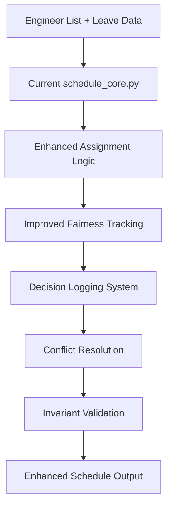

# Design Document

## Overview

This design enhances the existing team scheduling system with improved business logic for weekend shift patterns, on-call restrictions, daily role rotations, and leave management. Building upon the current `schedule_core.py` implementation, this design adds sophisticated fairness tracking, decision logging, and conflict resolution while maintaining compatibility with existing infrastructure.

## Architecture

### Enhanced Scheduling Engine (Building on Current Implementation)



### Business Logic Flow (Enhanced)

1. **Weekend Assignment**: Use existing rotation with enhanced fairness weighting
2. **On-Call Assignment**: Improve existing logic with weekend worker avoidance
3. **Early Shift Assignment**: Ensure on-call engineer + fair selection of second
4. **Daily Role Rotation**: Enhance existing rotation with better conflict handling
5. **Leave Management**: Improve existing backfill logic with intelligent selection
6. **Fairness Tracking**: Add comprehensive Gini coefficient analysis
7. **Decision Logging**: Add transparent decision tracking throughout
8. **Validation**: Enhance existing invariant checking with business rule validation

## Components and Interfaces

### Enhanced Weekend Assignment (Building on Existing Logic)

```python
# Enhance existing weekend_worker_for_week function
def enhanced_weekend_assignment(engineers: List[str], week_idx: int, fairness_tracker: 'EnhancedFairnessTracker') -> str:
    """
    Enhanced weekend assignment that considers fairness weighting.
    Builds upon existing build_rotation and weekend_worker_for_week functions.
    """
    
def calculate_weekend_compensation(engineer: str, date: date, weekend_pattern: str) -> List[date]:
    """Calculate compensatory time off for weekend workers"""
```

### Enhanced On-Call Assignment (Improving Existing Logic)

```python
# Enhance existing on-call assignment in generate_day_assignments
def enhanced_oncall_selection(available: List[str], weekend_seeded: List[str], 
                             week_idx: int, day_idx: int, decision_log: List[DecisionEntry]) -> str:
    """
    Enhanced on-call selection that avoids weekend workers when possible.
    Builds upon existing rotation logic with conflict avoidance.
    """
    
def should_avoid_weekend_worker(engineer: str, current_week: int, weekend_rotation: List[str]) -> bool:
    """Check if engineer should be avoided for on-call due to weekend work"""
```

### Enhanced Early Shift Assignment (Modifying Existing Logic)

```python
# Enhance existing early shift assignment in generate_day_assignments
def enhanced_early_shift_assignment(working: List[str], oncall_engineer: str, 
                                   engineers: List[str], seeds: Dict[str, int], 
                                   day_idx: int, decision_log: List[DecisionEntry]) -> Tuple[str, str]:
    """
    Enhanced early shift assignment ensuring on-call engineer is always included.
    Modifies existing logic to guarantee on-call + fair selection of second.
    """
    
def select_second_early_engineer(available: List[str], oncall_engineer: str, 
                                fairness_tracker: 'EnhancedFairnessTracker') -> str:
    """Select second early shift engineer based on fairness and availability"""
```

### Enhanced Daily Role Assignment (Improving Existing Logic)

```python
# Enhance existing chat and appointments assignment in generate_day_assignments
def enhanced_role_assignment(available: List[str], role: str, engineers: List[str], 
                           seeds: Dict[str, int], day_idx: int, 
                           decision_log: List[DecisionEntry]) -> str:
    """
    Enhanced role assignment with better conflict handling and decision logging.
    Builds upon existing rotation logic with improved fairness consideration.
    """
    
def get_role_rotation_order(engineers: List[str], role: str, seed: int, 
                           fairness_tracker: 'EnhancedFairnessTracker') -> List[str]:
    """Get rotation order considering fairness weighting"""
```

### Enhanced Fairness Tracking (Extending Existing Implementation)

```python
# Extend existing FairnessReport and EngineerStats from models.py
class EnhancedFairnessTracker:
    def __init__(self, engineers: List[str]):
        self.engineers = engineers
        self.historical_assignments: Dict[str, List[str]] = {}
        
    def track_assignment_with_weight(self, engineer: str, role: str, date: str, weight: float = 1.0):
        """Track role assignment with configurable weighting for fairness"""
        
    def get_weighted_workload(self, engineer: str) -> float:
        """Calculate weighted workload considering role difficulty/desirability"""
        
    def suggest_fairness_improvements(self, current_assignments: Dict) -> List[str]:
        """Generate actionable suggestions for improving fairness"""
        
    def calculate_role_distribution_variance(self) -> Dict[str, float]:
        """Calculate variance in role distribution for each role type"""

# Enhance existing calculate_fairness_report function
def calculate_enhanced_fairness_report(df: pd.DataFrame, engineers: List[str], 
                                     decision_log: List[DecisionEntry]) -> FairnessReport:
    """Enhanced fairness calculation with insights and recommendations"""
```

### Enhanced Leave Management (Improving Existing Logic)

```python
# Enhance existing leave handling in generate_day_assignments
def enhanced_backfill_selection(backfill_candidates: List[str], required_roles: List[str],
                               fairness_tracker: EnhancedFairnessTracker,
                               decision_log: List[DecisionEntry]) -> List[str]:
    """
    Enhanced backfill selection that considers fairness and role requirements.
    Improves upon existing find_backfill_candidates function.
    """
    
def calculate_leave_impact_on_fairness(leave_map: Dict[str, set], engineers: List[str]) -> Dict[str, float]:
    """Calculate how leave affects fairness distribution"""
    
def suggest_leave_alternatives(conflicts: List[str], available_engineers: List[str]) -> List[str]:
    """Suggest alternative coverage strategies when leave creates conflicts"""

# Enhance existing leave processing
def process_leave_with_enhanced_logic(leave: pd.DataFrame, engineers: List[str]) -> Dict[str, set]:
    """Process leave entries with enhanced validation and conflict detection"""
```

## Data Models (Extending Existing Implementation)

### Enhanced Schedule Data (Building on Current DataFrame Structure)

```python
# Current DataFrame columns (from existing implementation):
# ["Date","Day","WeekIndex","Early1","Early2","Chat","OnCall","Appointments"]
# + [f"{i+1}) Engineer", f"Status {i+1}", f"Shift {i+1}"] for each engineer

# Enhanced data structures (extending existing models.py):
@dataclass
class EnhancedDecisionEntry(DecisionEntry):
    """Extended decision entry with fairness impact tracking"""
    fairness_impact: Optional[float] = None
    conflict_resolution_strategy: Optional[str] = None
    
@dataclass 
class WeekendCompensation:
    """Track compensatory time off for weekend workers"""
    engineer: str
    weekend_date: date
    compensation_dates: List[date]
    pattern_type: str  # 'A' or 'B'
```

### Enhanced Schedule Output (Extending Existing ScheduleResult)

```python
# Extend existing ScheduleResult from models.py
@dataclass
class EnhancedScheduleResult(ScheduleResult):
    """Enhanced schedule result with additional analysis"""
    weekend_compensation_tracking: List[WeekendCompensation] = field(default_factory=list)
    conflict_resolution_log: List[str] = field(default_factory=list)
    fairness_insights: List[str] = field(default_factory=list)
    business_rule_compliance: Dict[str, bool] = field(default_factory=dict)

# Enhanced metadata (extending existing ScheduleMetadata)
@dataclass
class EnhancedScheduleMetadata(ScheduleMetadata):
    """Enhanced metadata with additional tracking"""
    decision_count_by_type: Dict[str, int] = field(default_factory=dict)
    conflict_resolution_count: int = 0
    fairness_score_trend: List[float] = field(default_factory=list)
```

## Error Handling (Extending Existing Validation)

### Enhanced Business Rule Validation

```python
# Extend existing ScheduleInvariantChecker from lib/invariant_checker.py
class EnhancedInvariantChecker(ScheduleInvariantChecker):
    def validate_oncall_early_shift_rule(self, df: pd.DataFrame) -> List[InvariantViolation]:
        """Validate on-call engineer is always on early shift during weekdays"""
        
    def validate_weekend_compensation_patterns(self, df: pd.DataFrame) -> List[InvariantViolation]:
        """Validate weekend workers get appropriate compensation time"""
        
    def validate_fairness_distribution_limits(self, fairness_report: FairnessReport) -> List[InvariantViolation]:
        """Validate fairness metrics are within acceptable ranges"""
        
    def validate_leave_coverage_adequacy(self, df: pd.DataFrame) -> List[InvariantViolation]:
        """Validate adequate coverage exists when engineers are on leave"""

# Extend existing validation with enhanced conflict detection
def enhanced_validate_scheduling_conflicts(roles: Dict[str, str], working: List[str], 
                                         d: date, weekend_rotation: List[str]) -> List[str]:
    """Enhanced conflict validation with weekend worker awareness"""
```

### Enhanced Conflict Resolution Strategies

1. **Leave Conflicts**: Enhanced backfill selection with fairness consideration
2. **Fairness Imbalances**: Automated suggestions with specific role swap recommendations  
3. **Coverage Gaps**: Intelligent minimum viable assignment with priority role identification
4. **Weekend-OnCall Conflicts**: Smart avoidance of assigning weekend workers to on-call when possible
5. **Early Shift Conflicts**: Guarantee on-call engineer inclusion with fair secondary selection

## Testing Strategy (Extending Existing Test Suite)

### Enhanced Business Logic Testing

**Enhanced Weekend Assignment Tests**:
```python
def test_enhanced_weekend_fairness_weighting():
    """Test weekend assignments consider fairness tracker weighting"""
    
def test_weekend_compensation_tracking():
    """Test weekend workers get tracked compensation time"""
    
def test_weekend_rotation_with_leave():
    """Test weekend rotation handles engineer leave gracefully"""
```

**Enhanced On-Call Assignment Tests**:
```python
def test_oncall_avoids_weekend_workers():
    """Test on-call assignment prefers non-weekend workers when possible"""
    
def test_oncall_early_shift_guarantee():
    """Test on-call engineer is always included in early shift"""
    
def test_oncall_decision_logging():
    """Test on-call assignment decisions are properly logged"""
```

**Enhanced Fairness and Decision Logging Tests**:
```python
def test_gini_coefficient_calculation():
    """Test Gini coefficient fairness calculation accuracy"""
    
def test_decision_log_completeness():
    """Test all assignment decisions are logged with rationale"""
    
def test_fairness_insights_generation():
    """Test actionable fairness insights are generated"""
    
def test_conflict_resolution_logging():
    """Test conflict resolution strategies are logged"""
```

**Enhanced Leave Management Tests**:
```python
def test_intelligent_backfill_selection():
    """Test backfill selection considers fairness and role requirements"""
    
def test_leave_impact_on_fairness():
    """Test leave days don't negatively impact fairness calculations"""
    
def test_insufficient_coverage_handling():
    """Test system gracefully handles insufficient coverage scenarios"""
```

### Enhanced Algorithm Design (Building on Existing Implementation)

**Enhanced Weekend Assignment Algorithm**:
```python
def enhanced_weekend_assignment(engineers: List[str], week_idx: int, fairness_tracker: EnhancedFairnessTracker) -> str:
    """
    Enhanced Algorithm (modifying existing weekend_worker_for_week):
    1. Use existing rotation logic as base
    2. Apply fairness weighting to prefer engineers with lower weekend counts
    3. Track weekend compensation requirements
    4. Log assignment decisions with alternatives considered
    """
```

**Enhanced On-Call Assignment Algorithm**:
```python
def enhanced_oncall_selection(available: List[str], weekend_seeded: List[str], week_idx: int) -> str:
    """
    Enhanced Algorithm (modifying existing on-call logic in generate_day_assignments):
    1. Use existing rotation order as base
    2. Filter out current and next week's weekend workers when possible
    3. Fall back to any available engineer if no non-weekend options
    4. Log decision rationale and alternatives considered
    """
```

**Enhanced Early Shift Assignment Algorithm**:
```python
def enhanced_early_shift_assignment(working: List[str], oncall_engineer: str, fairness_tracker: EnhancedFairnessTracker) -> Tuple[str, str]:
    """
    Enhanced Algorithm (modifying existing early shift logic):
    1. Always assign on-call engineer as Early1
    2. Select Early2 from remaining available engineers using fairness weighting
    3. Log both assignments with rationale
    4. Track early shift assignments for fairness calculation
    """
```

## Implementation Phases (Building on Existing Infrastructure)

### Phase 1: Enhanced Assignment Logic
- Enhance weekend assignment with fairness weighting
- Improve on-call assignment with weekend worker avoidance  
- Modify early shift assignment to guarantee on-call inclusion

### Phase 2: Enhanced Fairness and Decision Tracking
- Extend existing fairness calculation with Gini coefficient insights
- Enhance decision logging throughout assignment process
- Add conflict resolution strategy tracking

### Phase 3: Enhanced Leave Management and Validation
- Improve existing backfill logic with intelligent selection
- Extend existing invariant checking with new business rules
- Add comprehensive fairness impact analysis

### Phase 4: Integration and Polish
- Integrate all enhancements with existing API and export systems
- Add comprehensive testing for new functionality
- Update documentation and monitoring for enhanced features

This design builds upon the solid foundation already in place, enhancing existing functionality rather than rebuilding from scratch. The phased approach allows for incremental improvement while maintaining system stability.