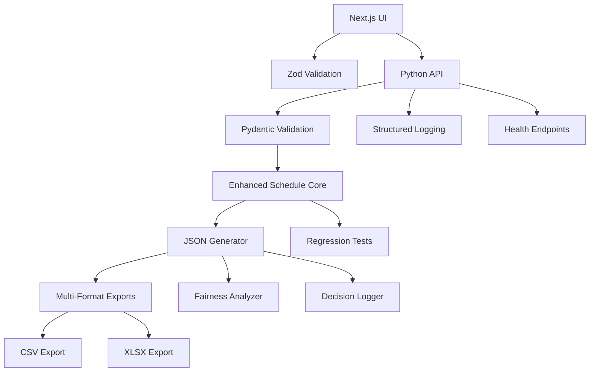

# Design Document

## Overview

This design transforms the existing team scheduler into a robust, enterprise-grade application with comprehensive testing, data integrity guarantees, fairness analysis, and enhanced user experience. The architecture maintains the existing Python/Next.js hybrid approach while adding structured validation, monitoring, and multi-format export capabilities.

## Architecture

### Core Components



### Data Flow Architecture

1. **Input Validation Layer**: Dual validation (UI + API) ensures data integrity at every entry point
2. **Core Scheduling Engine**: Enhanced with decision logging and fairness tracking
3. **JSON-First Export**: Single source of truth drives all output formats
4. **Testing Infrastructure**: Comprehensive regression tests with invariant checking
5. **Monitoring Layer**: Structured logging with request tracking and health endpoints

## Components and Interfaces

### Enhanced Schedule Core

```python
@dataclass
class ScheduleResult:
    schedule_data: Dict[str, Any]
    fairness_report: FairnessReport
    decision_log: List[DecisionEntry]
    metadata: ScheduleMetadata
    schema_version: str = "2.0"

@dataclass
class FairnessReport:
    engineer_stats: Dict[str, EngineerStats]
    equity_score: float
    max_min_deltas: Dict[str, int]

@dataclass
class DecisionEntry:
    date: str
    decision_type: str
    affected_engineers: List[str]
    reason: str
    alternatives_considered: List[str]
```

### Validation Schemas

**Frontend (Zod)**:
```typescript
const ScheduleRequestSchema = z.object({
  engineers: z.array(z.string().trim().min(1)).length(6).refine(uniqueEngineers),
  start_sunday: z.string().regex(/^\d{4}-\d{2}-\d{2}$/).refine(isSunday),
  weeks: z.number().int().min(1).max(52),
  seeds: SeedsSchema,
  leave: z.array(LeaveEntrySchema).optional(),
  format: z.enum(['csv', 'xlsx', 'json'])
});
```

**Backend (Pydantic)**:
```python
class ScheduleRequest(BaseModel):
    engineers: List[str] = Field(..., min_items=6, max_items=6)
    start_sunday: date
    weeks: int = Field(..., ge=1, le=52)
    seeds: SeedsConfig
    leave: List[LeaveEntry] = Field(default_factory=list)
    format: Literal['csv', 'xlsx', 'json'] = 'csv'
    
    @validator('engineers')
    def validate_unique_engineers(cls, v):
        if len(set(e.strip().lower() for e in v)) != len(v):
            raise ValueError("Engineer names must be unique")
        return [e.strip() for e in v]
```

### Export System

**JSON-First Architecture**:
```python
class ExportManager:
    def __init__(self, schedule_result: ScheduleResult):
        self.result = schedule_result
    
    def to_json(self) -> Dict[str, Any]:
        return {
            "schemaVersion": self.result.schema_version,
            "metadata": asdict(self.result.metadata),
            "schedule": self.result.schedule_data,
            "fairnessReport": asdict(self.result.fairness_report),
            "decisionLog": [asdict(entry) for entry in self.result.decision_log]
        }
    
    def to_csv(self) -> str:
        json_data = self.to_json()
        return self._json_to_csv(json_data["schedule"])
    
    def to_xlsx(self) -> bytes:
        json_data = self.to_json()
        return self._json_to_xlsx(json_data)
```

### Testing Infrastructure

**Regression Test Suite**:
```python
class ScheduleInvariantTests:
    def test_csv_column_consistency(self):
        """Assert every CSV row has exact column count"""
        
    def test_status_field_integrity(self):
        """Assert Status ∈ {WORK, OFF, LEAVE, ""} never engineer names"""
        
    def test_engineer_field_integrity(self):
        """Assert Engineer columns contain only known engineers"""
        
    def test_weekend_coverage_patterns(self):
        """Assert weekend patterns follow Week A/B rules"""
        
    def test_fairness_distribution(self):
        """Assert role distribution stays within equity bounds"""
```

## Data Models

### Enhanced Schedule Schema

```python
class ScheduleRow(BaseModel):
    date: date
    day: str
    week_index: int
    early1: str = ""
    early2: str = ""
    chat: str = ""
    oncall: str = ""
    appointments: str = ""
    engineers: List[EngineerStatus]

class EngineerStatus(BaseModel):
    name: str
    status: Literal["WORK", "OFF", "LEAVE", ""]
    shift: str = ""
    
    @validator('status')
    def validate_status_not_engineer_name(cls, v, values):
        if 'name' in values and v == values['name']:
            raise ValueError("Status cannot equal engineer name")
        return v
```

### CSV Schema with Versioning

```
# Schema Version: 2.0
# Generated: 2025-01-09T10:30:00Z
# Configuration: ops-default, 6 engineers, 8 weeks
Date,Day,WeekIndex,Early1,Early2,Chat,OnCall,Appointments,1) Engineer,Status 1,Shift 1,...
```

## Error Handling

### Structured Error Responses

```python
class ValidationError(BaseModel):
    field: str
    message: str
    code: str
    
class APIErrorResponse(BaseModel):
    error: str
    details: List[ValidationError] = []
    request_id: str
    timestamp: datetime
```

### Error Recovery Strategies

1. **Validation Failures**: Return 422 with detailed field-level errors
2. **Scheduling Conflicts**: Provide alternative suggestions in decision log
3. **Export Failures**: Fallback to JSON format with error details
4. **System Errors**: Log with request ID and return user-friendly message

## Testing Strategy

### Multi-Layer Testing Approach

**Unit Tests (Python)**:
- Core scheduling logic with edge cases
- Export format validation
- Fairness calculation accuracy
- Decision logging completeness

**Integration Tests (Python)**:
- End-to-end API request/response cycles
- Multi-format export consistency
- Database operations (if added)
- External service integrations

**Frontend Tests (TypeScript)**:
- Component rendering and interaction
- Form validation and error handling
- File download functionality
- Preset management

**E2E Tests (Playwright)**:
```typescript
test('complete scheduling workflow', async ({ page }) => {
  // Fill form with valid data
  // Generate schedule
  // Download and parse CSV
  // Assert invariants: column count, status values, engineer assignments
  // Verify fairness metrics
});
```

### Continuous Integration

**Dual-Lane CI Pipeline**:
```yaml
# .github/workflows/ci.yml
jobs:
  python-tests:
    runs-on: ubuntu-latest
    steps:
      - name: Run Python tests
      - name: Check coverage ≥90%
      - name: Lint with ruff
      
  node-tests:
    runs-on: ubuntu-latest
    steps:
      - name: Run TypeScript tests
      - name: Type checking
      - name: Lint with ESLint
      
  e2e-tests:
    needs: [python-tests, node-tests]
    runs-on: ubuntu-latest
    steps:
      - name: Run Playwright tests
```

### Performance and Reliability

**Monitoring and Observability**:
```python
@dataclass
class RequestMetrics:
    request_id: str
    start_time: datetime
    input_size: int
    engineer_count: int
    weeks: int
    processing_time_ms: int
    export_format: str
    cache_hit: bool = False
```

**Health Endpoints**:
```python
# /api/healthz - Basic health check
# /api/readyz - Readiness check with dependencies
# /api/metrics - Performance metrics (if monitoring added)
```

### Security Considerations

**Input Sanitization**:
- Engineer name normalization and length limits
- Date validation with reasonable bounds
- Request size limits (max engineers, weeks, leave entries)
- Rate limiting per IP/user

**Data Privacy**:
- Hash engineer names in logs
- Secure session management
- Team-scoped data isolation
- Audit trail for sensitive operations

### Deployment and Configuration

**Feature Flags (Vercel Edge Config)**:
```json
{
  "enableFairnessReporting": true,
  "enableDecisionLogging": true,
  "maxWeeksAllowed": 52,
  "enableAdvancedValidation": true
}
```

**Environment Configuration**:
```
ENABLE_AUTH=true
LOG_LEVEL=info
MAX_REQUEST_SIZE=1mb
FAIRNESS_THRESHOLD=0.8
```

This design provides a solid foundation for implementing all the requirements while maintaining the existing application's simplicity and effectiveness. The architecture supports incremental implementation, allowing us to add features progressively while maintaining system stability.